<h1 align="center">EduQuotes</h1>

## Описание
Приложение для просмотра цитат сделанный на python при помощи модуля PyQt5. Проект содержит возможность
просмотра, добавления, редактирования и удаления Цитат. Так же добавлена возможность 
копировать цитаты чтобы было проще делиться с друзьми и знакомыми

## Реализация
### Просмотр цитат
На главном экране (Library) отображаются все цитаты хранящиеся в базе данных 
Слева от цитат находится меню с кнопками для перехода на другие страницы 
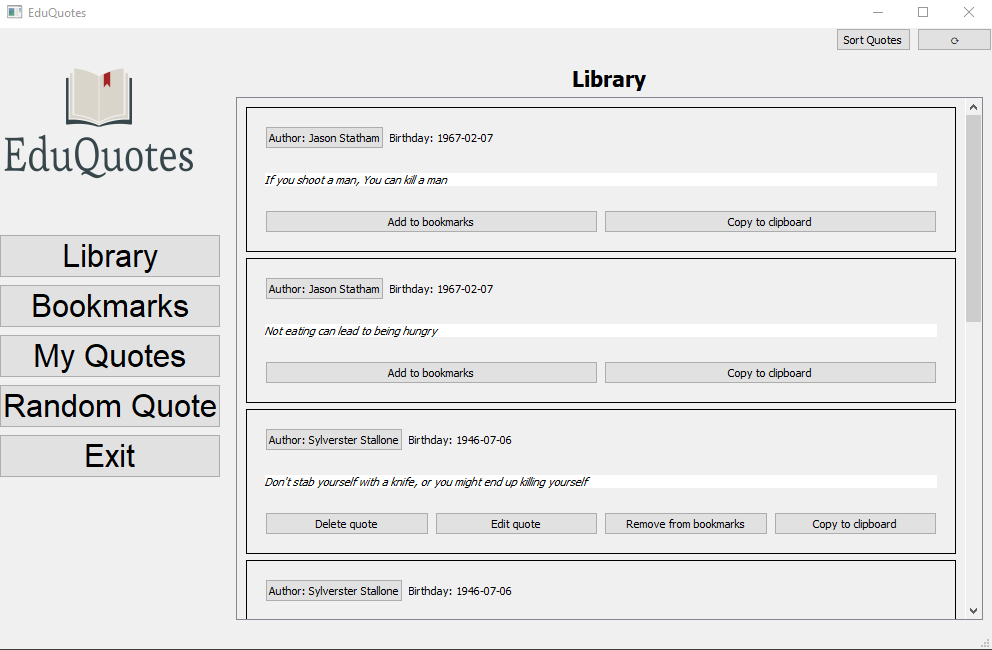 
Сверху справа есть две кнопки для обновления страницы в случае ошибок 
также кнопка для сортировки цитат 
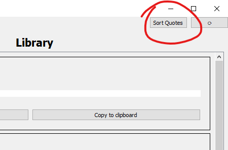 
При нажатии на кнопку сортировки появляется новое окно с возможными способами сортировки 
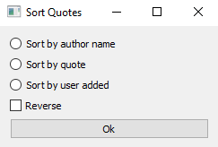 
Сами цитаты делятся на блоки. В зависимости от того сами ли вы добавляли цитаты 
или являетесь автором цитаты, будет меняться количество кнопок под цитатами 
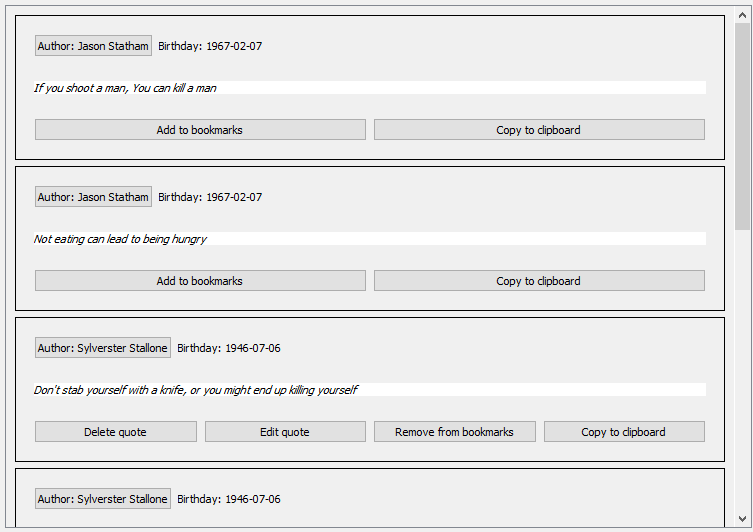 

### Закладки
Если нажать на кнопку **Bookmarks**, то вы попадете на экран ваших закладок 
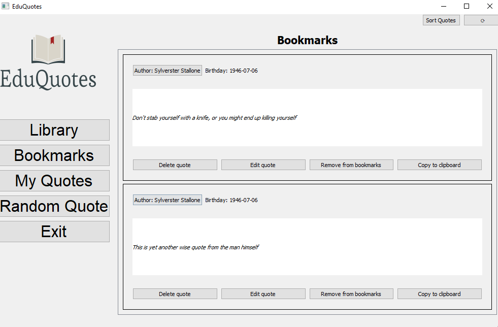 
Здесь хранятся все цитаты которые вы добавили в закладки.
Чтобы добавить цитату в закладки или убрать её оттуда нужно нажать на кнопку под цитатой 
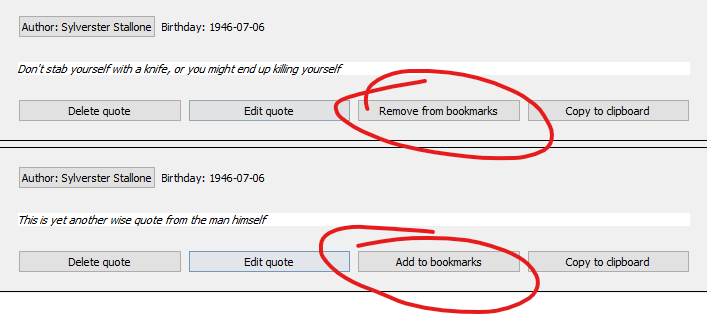 

### Мои цитаты
Если на кнопку **My Quotes**, то вы окажетесь на экране ваших собственных цитат
Где у вас есть возможность добавлять новые цитаты 
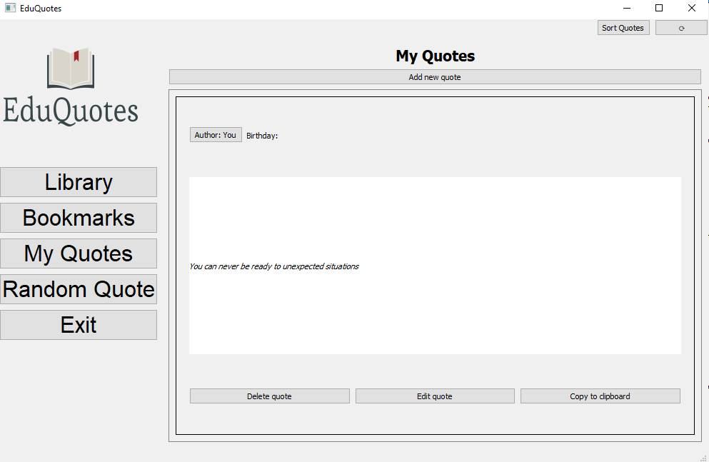 
Если нажать на кнопку **Add new quote**, то у вас откроется новое окно где вы можете
выбрать существующего автора, добавить нового автора или указать автором себя 
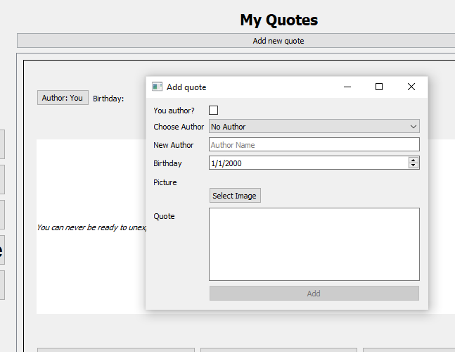 
Все цитаты которые вы добавили сами вы можете как удалить так и редактировать 
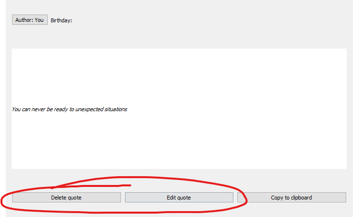 

### Случайная цитата
При нажатии на кнопку **Random Quote** вам дается случайная цитата из всех существующих 
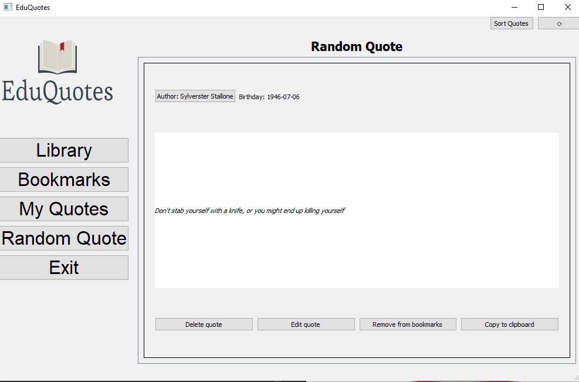 

### Страничка автора
В блоке цитат если нажать на имя автора, то откроется отдельное окно с информацией по автора 
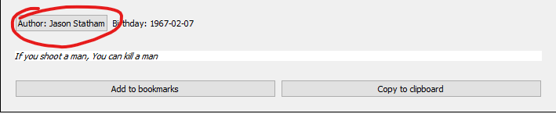 
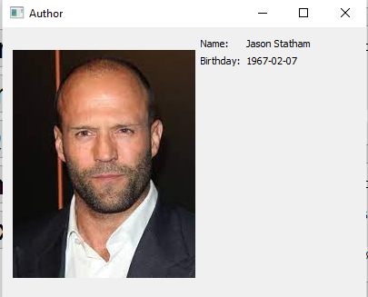 
